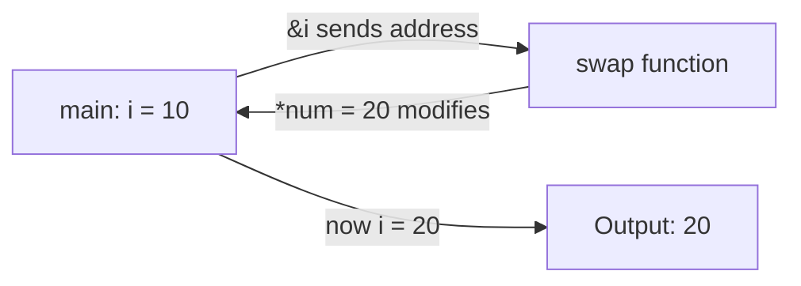

# Pointers and Memory

Go has pointers like C (`*` and `&`), but they are designed to be safe. Pointers allow you to pass references to values, enabling you to modify the original data without copying it.

## Pass-by-Reference

By default, Go copies arguments when passing them to functions. Use pointers to modify the original value instead of working with a copy.

```go
func swap(num *int){
	*num = 20
}

func main() {
	i := 10

	swap(&i)
	fmt.Println("the swap nuo is:", i)
}
```

### How It Works



- `&i` gets the memory address of variable `i`
- `*int` declares that `num` is a pointer to an integer
- `*num = 20` dereferences the pointer and modifies the original value

## No Pointer Arithmetic

<Warning>
Go prevents pointer arithmetic to ensure memory safety. You cannot do `p++` to move to the next memory address like in C/C++.
</Warning>

This safety feature prevents the buffer overflow bugs that plague C/C++ programs. While it limits low-level memory manipulation, it eliminates entire classes of security vulnerabilities.

### Why This Matters

In C/C++, you can increment a pointer to access adjacent memory:

```c
// C code - DANGEROUS
int arr[5] = {1, 2, 3, 4, 5};
int *p = arr;
p++;  // Now points to arr[1]
p += 10;  // Undefined behavior - accessing memory you don't own!
```

Go prevents this entirely:

```go
// Go code - SAFE
arr := [5]int{1, 2, 3, 4, 5}
p := &arr[0]
// p++  // Compile error! Invalid operation
```

## When to Use Pointers

### 1. Modifying Function Arguments

```go
func increment(n *int) {
    *n++
}

count := 5
increment(&count)
// count is now 6
```

### 2. Avoiding Large Copies

When working with large structs, use pointers to avoid copying the entire structure:

```go
type LargeStruct struct {
    data [1000000]int
}

// Efficient - passes only a pointer (8 bytes)
func process(s *LargeStruct) {
    // work with s.data
}

// Inefficient - copies 8MB of data
func processBad(s LargeStruct) {
    // work with s.data
}
```

### 3. Nil Values

Pointers can be `nil`, representing "no value":

```go
var p *int
if p == nil {
    fmt.Println("p points to nothing")
}
```

## Memory Safety Guarantees

Go's pointer safety comes from several restrictions:

1. **No pointer arithmetic** - Cannot increment or decrement pointers
2. **Garbage collection** - Automatic memory management prevents dangling pointers
3. **No explicit deallocation** - Cannot manually free memory (no `free()` or `delete`)
4. **Type safety** - Cannot cast arbitrary integers to pointers

<Note>
Go's garbage collector automatically frees memory when it's no longer referenced, preventing memory leaks and dangling pointer bugs.
</Note>

## Common Patterns

### The & Operator (Address-of)

Takes the memory address of a variable:

```go
x := 42
ptr := &x  // ptr now holds the address of x
```

### The * Operator (Dereference)

Accesses the value at a pointer's address:

```go
fmt.Println(*ptr)  // Prints 42
*ptr = 100         // Changes x to 100
```

### Pointer Receivers

Methods can use pointer receivers to modify the struct:

```go
type Counter struct {
    count int
}

func (c *Counter) Increment() {
    c.count++  // Modifies the original struct
}
```

See the [Structs](/advanced/structs) chapter for more on methods and receivers.