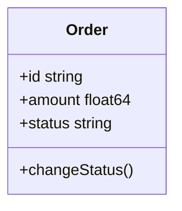

# Struct Types and Methods

Structs are how we create custom data structures in Go. They allow you to group related data together and attach behavior through methods.

## Composition over Inheritance

Go doesn't have `class` or `extends` keywords. Instead of inheritance, Go uses composition - building complex types by combining simpler ones.



## Defining Structs

Here's a real-world example of an Order struct:

```go
type Order struct {
	id        string
	amount    float64
	status    string
	createdAt time.Time //nanoseconds since epoch
}
```

### Creating Instances

There are multiple ways to create struct instances:

```go
// 1. Literal syntax with field names
Order := Order{
	id:		"12345",
	amount:	100.50,
	status:	"pending",
	createdAt: time.Now(),
}

// 2. Taking a pointer to it
myOrder := &Order

fmt.Println("Initial Order Status:", myOrder.status)
```

## Constructor Functions

Go doesn't have formal constructors, but the convention is to create `new` functions:

```go
func newOrder(id string, amount float64, status string) *Order {// constructor function
	myOrder := Order{
		id:        id,
		amount:    amount,
		status:    status,
}
return &myOrder
}
```

<Note>
Constructor functions typically return pointers (`*Order`) rather than values, making them more efficient for large structs.
</Note>

## Methods

Methods are functions with a special receiver argument. They attach behavior to your structs.

### Method Syntax

```go
func (o *Order) changeStatus(status string) {
// we create a bracket to define the method body
//o.status = status is a convention to access struct fields inside methods
	o.status = status
}
```

The receiver `(o *Order)` comes between `func` and the method name. This binds the method to the `Order` type.

### Using Methods

```go
myOrder := &Order{
    id:     "12345",
    amount: 100.50,
    status: "pending",
    createdAt: time.Now(),
}

myOrder.changeStatus("shipped")
fmt.Println("Updated Order Status:", myOrder.status)
```

Output:
```
Initial Order Status: pending
Updated Order Status: shipped
```

## Value vs Pointer Receivers

### Pointer Receivers (`*Order`)

Use pointer receivers when you need to:
- Modify the struct's fields
- Avoid copying large structs
- Maintain consistency (if some methods use pointers, all should)

```go
func (o *Order) changeStatus(status string) {
    o.status = status  // Modifies the original
}
```

### Value Receivers (`Order`)

Use value receivers for:
- Small, immutable structs
- Methods that don't modify state
- When you explicitly want a copy

```go
func (o Order) getTotal() float64 {
    return o.amount  // Doesn't modify anything
}
```

## Exported vs Unexported Fields

Go uses capitalization to control visibility:

```go
type Order struct {
    ID        string    // Exported (public)
    Amount    float64   // Exported (public)
    status    string    // Unexported (private)
    createdAt time.Time // Unexported (private)
}
```

- **Uppercase** fields are exported (accessible from other packages)
- **Lowercase** fields are unexported (private to the package)

## Embedded Structs (Composition)

Instead of inheritance, Go uses embedding:

```go
type Address struct {
    Street string
    City   string
    ZIP    string
}

type Customer struct {
    Name    string
    Email   string
    Address // Embedded struct
}

cust := Customer{
    Name:  "Alice",
    Email: "alice@example.com",
    Address: Address{
        Street: "123 Main St",
        City:   "Boston",
        ZIP:    "02101",
    },
}

// Access embedded fields directly
fmt.Println(cust.City)  // "Boston"
```

The `Customer` struct "has-a" `Address` rather than "is-a" Address. This is composition.

## Struct Tags

Struct tags provide metadata for serialization and validation:

```go
type Order struct {
    ID     string  `json:"id" db:"order_id"`
    Amount float64 `json:"amount" db:"total_amount"`
    Status string  `json:"status" db:"order_status"`
}
```

Tags are used by packages like `encoding/json` to control marshaling:

```go
order := Order{ID: "123", Amount: 50.0, Status: "pending"}
jsonData, _ := json.Marshal(order)
// {"id":"123","amount":50,"status":"pending"}
```

## Zero Values

Uninitialized struct fields get their type's zero value:

```go
var order Order
// order.id == ""
// order.amount == 0.0
// order.status == ""
// order.createdAt == time.Time{} (zero time)
```

This prevents the "undefined" errors common in other languages.

## Best Practices

1. **Use pointer receivers** for methods that modify the struct
2. **Keep constructors simple** - just initialize and return
3. **Prefer composition** over complex struct hierarchies
4. **Export selectively** - only expose what's necessary
5. **Use tags** for JSON/XML/database mapping

<Note>
Structs are value types. Assigning one struct to another creates a copy. Use pointers when you want to share the same instance.
</Note>

Next, learn how to define behavior contracts with [Interfaces](/advanced/interfaces).