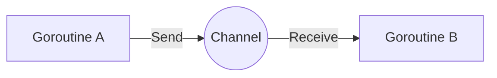

# Channels

Channels are pipes that connect concurrent goroutines. The Go philosophy is: **"Don't communicate by sharing memory; share memory by communicating."**

## The Pipe Concept

A channel allows you to send values from one goroutine and receive them in another. The syntax uses the `<-` operator:

- `channel <- value` sends a value into the channel
- `value := <-channel` receives a value from the channel



## Creating Channels

Channels are created using the `make` function:

```go
messageChain := make(chan string)
```

This creates an unbuffered channel that can pass `string` values between goroutines.

## The Deadlock Example

Here's code that demonstrates a common pitfall:

```go
package main

import "fmt"

func main() {
	messageChain := make(chan string)

	messageChain <- "Hello, "

	msg := <-messageChain
	msg += "Channels!"

	fmt.Println(msg)
}
```

<Warning>
**The Deadlock Trap**

This code will crash with: `fatal error: all goroutines are asleep - deadlock!`

Writing to an unbuffered channel **blocks forever** until someone reads it. If you write in `main` without a background reader, `main` blocks forever waiting for a receiver that never comes.

Since no other goroutine is running to receive the value, all goroutines are blocked, resulting in a deadlock.
</Warning>

## How Unbuffered Channels Work

Unbuffered channels have no capacity. Both send and receive operations block:

1. **Send blocks** until another goroutine receives
2. **Receive blocks** until another goroutine sends

This synchronization is by design - it ensures that sender and receiver are in sync.

## Fixing the Deadlock

There are several ways to fix the deadlock:

### Solution 1: Use a Goroutine

```go
package main

import "fmt"

func main() {
    messageChain := make(chan string)

    // Send in a separate goroutine
    go func() {
        messageChain <- "Hello, "
    }()

    msg := <-messageChain
    msg += "Channels!"

    fmt.Println(msg)
}
```

### Solution 2: Use a Buffered Channel

```go
package main

import "fmt"

func main() {
    messageChain := make(chan string, 1) // Buffer size of 1

    messageChain <- "Hello, " // Doesn't block because buffer has space

    msg := <-messageChain
    msg += "Channels!"

    fmt.Println(msg)
}
```

Buffered channels only block when:
- **Send**: Buffer is full
- **Receive**: Buffer is empty

## Channel Operations

### Sending Values

```go
channel <- value
```

### Receiving Values

```go
value := <-channel
```

### Closing Channels

```go
close(channel)
```

After closing, sends will panic but receives will return the zero value.

### Checking if Closed

```go
value, ok := <-channel
if !ok {
    // Channel was closed
}
```

## Buffered vs Unbuffered

| Feature | Unbuffered | Buffered |
|---------|------------|----------|
| Creation | `make(chan T)` | `make(chan T, size)` |
| Send blocks when | Always (until receive) | Buffer is full |
| Receive blocks when | Always (until send) | Buffer is empty |
| Synchronization | Guaranteed | Only when buffer full/empty |

## Channel Patterns

Channels enable powerful concurrency patterns:

- **Pipeline**: Chain goroutines together
- **Fan-out**: Distribute work across multiple workers
- **Fan-in**: Combine results from multiple sources
- **Select**: Wait on multiple channel operations

Channels are one of Go's most powerful features for writing safe concurrent code.