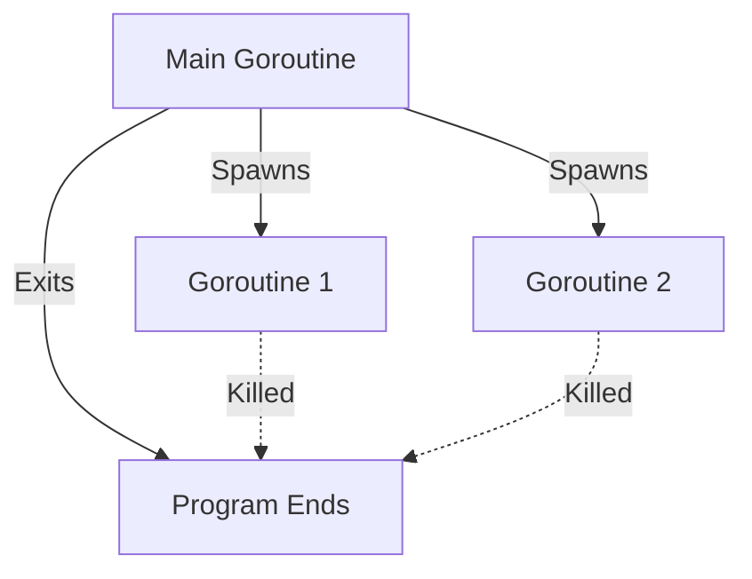

# Goroutines

Go is famous for concurrency. It uses an **M:N Scheduler** to run millions of lightweight threads called goroutines.

## The `go` Keyword

Just adding `go` before a function call runs it in the background as a concurrent goroutine.

```go
package main

import "fmt"

func main(){
    for i:=0; i<10; i++ {
		go func(n int){
			fmt.Println(n)
		}(i)

}
}
```

## The M:N Scheduler

Go uses an **M:N Scheduler** that maps M goroutines onto N OS threads. This is what makes goroutines so lightweight compared to traditional threads:

- **Goroutines**: Lightweight, managed by Go runtime, ~2KB stack
- **OS Threads**: Heavy, managed by kernel, ~1MB+ stack

The Go scheduler multiplexes thousands or millions of goroutines onto a small number of OS threads, making concurrency extremely efficient.



<Warning>
**The Mystery of Empty Output**

When `main()` finishes, the program dies instantly. It does **NOT** wait for background goroutines to finish.

If you run the code above, you might see nothing printed, or only partial output. This is because the main goroutine exits before the spawned goroutines have a chance to execute.

**Fix**: Use `WaitGroups` or Channels to make `main` wait for goroutines to complete.
</Warning>

## How Goroutines Work

When you spawn a goroutine with the `go` keyword:

1. The function call is scheduled to run concurrently
2. The main goroutine continues executing immediately (doesn't wait)
3. The Go scheduler manages when each goroutine gets CPU time
4. All goroutines are terminated when the main goroutine exits

## Anonymous Functions with Goroutines

In the example above, we use an anonymous function that takes a parameter `n`:

```go
go func(n int){
    fmt.Println(n)
}(i) // Calls anonymous function in background, passing i as n
```

This pattern is common because it captures the loop variable's value at the time the goroutine is created, preventing race conditions.

## Why Lightweight?

Goroutines are incredibly efficient:

- **Small stack size**: Start with ~2KB (vs 1MB+ for OS threads)
- **Fast creation**: Creating a goroutine is much faster than creating an OS thread
- **Efficient switching**: The Go scheduler switches between goroutines in user space, avoiding expensive kernel context switches
- **Scalability**: You can easily run 100,000+ goroutines on modest hardware

The M:N scheduler intelligently maps these lightweight goroutines onto a pool of OS threads, giving you the performance of async programming with the simplicity of synchronous code.