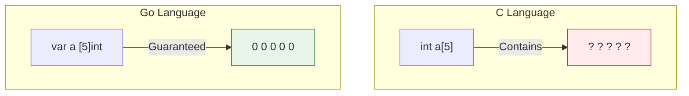

## Overview

Arrays in Go are fixed-size collections of elements of the same type. Unlike C, Go arrays are **always zero-initialized**, eliminating garbage memory vulnerabilities.

<Info>
In Go, arrays are generally used when you need a fixed-size collection. For dynamic collections, use [slices](/data-structures/slices).
</Info>

## Zero Initialization

One of Go's safety features is guaranteed zero initialization. When you declare an array without explicitly setting values, Go automatically initializes all elements to their zero value.



<Warning>
In C, `int a[5]` contains garbage memory. In Go, it is **always** zeroed `[0 0 0 0 0]`.
</Warning>

## Basic Array Declaration

Here's how to declare and work with arrays in Go:

```go arrays/main.go
package main

import "fmt"

func main() {

	var nums [5]int //declaration of an array of integers with size 5

	fmt.Println("Initial array:", nums)
	fmt.Println(len(nums))

	two := [2][3]int{{1, 2, 3}, {4, 5, 6}}

	fmt.Println("Two-dimensional array:", two)

}
```

**Output:**
```
Initial array: [0 0 0 0 0]
5
Two-dimensional array: [[1 2 3] [4 5 6]]
```

## Key Characteristics

### Fixed Size

The size of an array is part of its type. An array of `[5]int` is a different type from `[10]int`.

```go
var nums [5]int  // Array of 5 integers
// Cannot resize - size is fixed at compile time
```

<Note>
The `len()` function returns the length of the array, which is always the size specified at declaration.
</Note>

### Multi-dimensional Arrays

Go supports multi-dimensional arrays for matrices and grids:

```go
two := [2][3]int{{1, 2, 3}, {4, 5, 6}}
// Creates a 2x3 array (2 rows, 3 columns)
```

## When to Use Arrays

<Tip>
Use arrays when:
- You know the exact size at compile time
- The size will never change
- You need the performance benefit of stack allocation
- You're working with fixed-size data structures (e.g., RGB colors, coordinates)
</Tip>

For most use cases, Go developers prefer **slices** over arrays because slices are more flexible and idiomatic.

## Zero Values by Type

| Type | Zero Value |
|------|------------|
| `int`, `int8`, `int16`, `int32`, `int64` | `0` |
| `float32`, `float64` | `0.0` |
| `bool` | `false` |
| `string` | `""` (empty string) |
| Pointer types | `nil` |

<Info>
**No 'undefined' errors.** If you declare `var nums [5]int` but don't set values, Go initializes each element to `0`. No garbage memory.
</Info>

## Next Steps

Arrays are the foundation for understanding [slices](/data-structures/slices), which are dynamic wrappers around arrays and the preferred way to work with collections in Go.