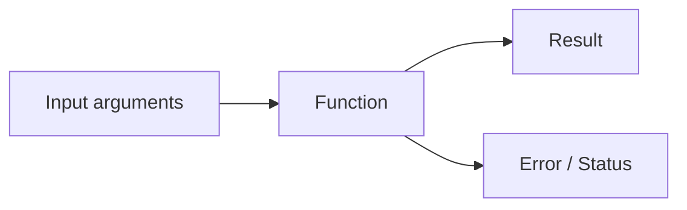

Functions are the building blocks of Go. They are "First Class Citizens", meaning you can pass them around like variables, store them, and use them as arguments.

## Basic Function Syntax

A function in Go is declared using the `func` keyword, followed by the function name, parameters, return type, and body.

```go
func Add(a int, b int) int {
	return a + b
}
```

<Note>
Function names that start with a capital letter (like `Add`) are exported and can be used by other packages. Lowercase names are private to the package.
</Note>

## Multiple Return Values

One of Go's most powerful features is the ability to return multiple values from a function. This pattern is used extensively throughout the language, especially for error handling.



Here's how to return multiple values:

```go
func getLanguage() (string, string) {
	return "Go", "Golang"
}
```

To use multiple return values, capture them with multiple variables:

```go
language, fullName := getLanguage()
println("Language:", language)    // Output: Language: Go
println("Full Name:", fullName)  // Output: Full Name: Golang
```

<Tip>
Go encourages returning `(result, error)` pairs. This makes error handling explicit and harder to ignore.
</Tip>

## Functions as First-Class Citizens

In Go, functions can be:
- Assigned to variables
- Passed as arguments to other functions
- Returned from other functions

This enables powerful functional programming patterns.

### Passing Functions as Arguments

You can pass a function as a parameter by specifying its signature:

```go
func processIt(fn func(int, int) int, x int, y int) int {
	return fn(x, y)
}
```

Using it:

```go
sum := processIt(Add, 10, 20)
println("Processed Sum:", sum)  // Output: Processed Sum: 30
```

<Info>
The parameter `fn func(int, int) int` means: "a function that takes two ints and returns an int".
</Info>

## Complete Example

Here's a complete program demonstrating all these concepts:

```go
package main

func Add(a int, b int) int {
	return a + b
}

func getLanguage() (string, string) {
	return "Go", "Golang"
}

func processIt(fn func(int, int) int, x int, y int) int {
	return fn(x, y)
}

func main() {
	result := Add(3, 5)
	println("The sum is:", result)

	// Function can return multiple values
	language, fullName := getLanguage()
	println("Language:", language)
	println("Full Name:", fullName)

	// Functions are first class citizens in Go
	sum := processIt(Add, 10, 20)
	println("Processed Sum:", sum)
	// We can pass functions as arguments to other functions
}
```

## Key Takeaways

<CardGroup cols={2}>
  <Card title="Multiple Returns" icon="arrow-turn-down-right">
    Go functions can return multiple values, making error handling explicit and natural.
  </Card>
  <Card title="First-Class Functions" icon="function">
    Functions can be passed as arguments, enabling flexible and reusable code patterns.
  </Card>
  <Card title="Clear Signatures" icon="signature">
    Function types like `func(int, int) int` make it clear what a function accepts and returns.
  </Card>
  <Card title="No Parentheses" icon="circle-xmark">
    Unlike many languages, Go doesn't require parentheses around return types in multi-value returns.
  </Card>
</CardGroup>

<Warning>
**Zero Values Matter**: If you declare a function that returns values but don't explicitly return them, Go will return the zero values for those types (0 for int, "" for string, nil for pointers, etc.).
</Warning>