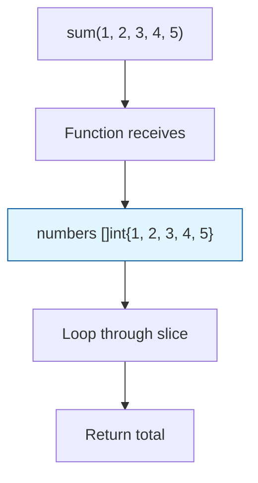

Sometimes you don't know how many arguments you'll receive. Variadic functions solve this problem elegantly, just like `fmt.Println` which can accept any number of arguments.

## The `...` Syntax

Using `...type` allows a function to accept an unlimited number of arguments of that type. Inside the function, these arguments arrive as a slice.

```go
func sum(numbers ...int) int {
	total := 0
	for _, num := range numbers {
		total += num
	}
	return total
}
```

<Info>
The `...int` parameter means "zero or more int values". Inside the function, `numbers` is just a `[]int` slice.
</Info>

## Calling Variadic Functions

You can call a variadic function with any number of arguments:

```go
result := sum(1, 2, 3, 4, 5)
println("Sum:", result)  // Output: Sum: 15

// You can also call it with no arguments
result2 := sum()
println("Sum:", result2)  // Output: Sum: 0

// Or just one argument
result3 := sum(42)
println("Sum:", result3)  // Output: Sum: 42
```

## How It Works

The variadic parameter is treated as a slice within the function:



<Tip>
Since variadic parameters are slices, you can use all slice operations: `len()`, `range`, indexing, etc.
</Tip>

## Variadic with `interface{}`

You can create variadic functions that accept any type using the empty interface:

```go
func lo(numbers ...interface{}) {
	for _, num := range numbers {
		println(num)
	}
}
```

This allows you to pass mixed types:

```go
lo(1, "hello", 3.14, true)
// Output:
// 1
// hello
// 3.14
// true
```

<Note>
`interface{}` means "any type". This is how `fmt.Println` can accept different types. In modern Go (1.18+), you might use generics instead.
</Note>

## Passing a Slice to Variadic Functions

If you already have a slice, you can "unpack" it using the `...` operator:

```go
numbers := []int{1, 2, 3, 4, 5}
result := sum(numbers...)  // The ... unpacks the slice
println("Sum:", result)     // Output: Sum: 15
```

<Warning>
**Don't confuse the two uses of `...`:**
- In function **definition**: `func sum(numbers ...int)` - receives multiple arguments
- In function **call**: `sum(slice...)` - unpacks a slice into individual arguments
</Warning>

## Complete Example

```go
package main

func sum(numbers ...int) int {
	total := 0
	for _, num := range numbers {
		total += num
	}
	return total
}

func lo(numbers ...interface{}) {
	for _, num := range numbers {
		println(num)
	}
}

func main() {
	result := sum(1, 2, 3, 4, 5)
	println("Sum:", result)
}
```

## Rules and Constraints

<Steps>
  <Step title="Last Parameter Only">
    The variadic parameter must be the **last** parameter in the function signature.
    
    ```go
    // Valid
    func print(prefix string, values ...int) {}
    
    // Invalid - won't compile
    func invalid(values ...int, suffix string) {}
    ```
  </Step>
  
  <Step title="Only One Variadic Parameter">
    You can only have **one** variadic parameter per function.
    
    ```go
    // Invalid - won't compile
    func invalid(nums ...int, strs ...string) {}
    ```
  </Step>
  
  <Step title="Zero or More Arguments">
    Variadic functions accept zero or more arguments of the specified type.
    
    ```go
    sum()           // Valid - 0 arguments
    sum(1)          // Valid - 1 argument
    sum(1, 2, 3)    // Valid - 3 arguments
    ```
  </Step>
</Steps>

## Real-World Examples

Many built-in Go functions use variadic parameters:

```go
// fmt.Println accepts any number of arguments
fmt.Println("Hello", "World", 123, true)

// append accepts a slice and any number of elements
slice := []int{1, 2, 3}
slice = append(slice, 4, 5, 6)

// max/min functions (Go 1.21+)
max := max(5, 2, 8, 1, 9)  // Returns 9
```

## Key Takeaways

<CardGroup cols={2}>
  <Card title="Flexible Arguments" icon="ellipsis">
    The `...` syntax allows functions to accept any number of arguments.
  </Card>
  <Card title="Slice Inside" icon="list">
    Variadic parameters are treated as slices within the function body.
  </Card>
  <Card title="Unpacking with ..." icon="box-open">
    Use `slice...` to unpack a slice into individual arguments when calling.
  </Card>
  <Card title="Must Be Last" icon="arrow-down-to-line">
    Variadic parameters must always be the last parameter in the signature.
  </Card>
</CardGroup>