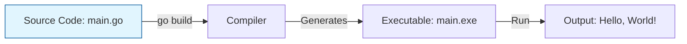

Every programming journey begins with "Hello, World!" - a simple program that displays text on the screen. This seemingly simple program teaches you the fundamental structure of Go applications.

## Your first program

Create a file named `main.go` and add the following code:

```go
package main

import "fmt"

func main(){
	fmt.Println("Hello, World!")
}
```

This is a complete Go program. Let's understand what each part does.

## Understanding the structure

<Steps>
  <Step title="Package declaration">
    ```go
    package main
    ```
    Every Go file starts with a package declaration. The `main` package is special - it tells Go this is an executable program, not a library.
  </Step>
  
  <Step title="Import statement">
    ```go
    import "fmt"
    ```
    The `import` keyword brings in code from other packages. Here, `fmt` (short for "format") provides functions for formatted I/O, including printing to the console.
  </Step>
  
  <Step title="Main function">
    ```go
    func main(){
        fmt.Println("Hello, World!")
    }
    ```
    The `main()` function is the entry point of your program - it's where execution begins. When you run your program, Go automatically calls this function.
  </Step>
</Steps>

## Running your program

Go provides two ways to execute your code:

### Quick execution with `go run`

```bash
go run main.go
```

This compiles and runs your program in one step. Perfect for development and testing.

<Tip>
`go run` is great for quick iteration during development. It compiles your code to a temporary location and executes it immediately.
</Tip>

### Building an executable with `go build`

```bash
go build
```

This creates a standalone executable file. On Windows, you'll get `main.exe`. On macOS or Linux, you'll get a file named after your directory or `main`.

You can then run the executable directly:

```bash
./main        # On macOS/Linux
main.exe      # On Windows
```

<Info>
Compiled Go programs are completely standalone. You can copy the executable to another computer (with the same OS and architecture) and run it without installing Go.
</Info>

## How compilation works

Understanding Go's compilation process helps you appreciate its speed and simplicity:



1. **Source code**: You write human-readable Go code
2. **Compiler**: The Go compiler translates your code into machine code
3. **Executable**: A binary file your computer can run directly
4. **Output**: Your program runs and displays the result

## Why `package main`?

Go needs to distinguish between two types of code:

- **Applications**: Programs you can run (use `package main`)
- **Libraries**: Code that other programs can use (use any other package name)

<Note>
Unlike scripting languages like Python or JavaScript, Go requires this explicit distinction. This prevents common mistakes like accidentally trying to run library code or importing application code as a library.
</Note>

## Common mistakes

<Warning>
**Missing the main function**: If your file has `package main` but no `func main()`, Go will compile it but you can't run it. You'll get an error: "function main is undeclared in the main package".
</Warning>

<Warning>
**Wrong package name**: If you use a package name other than `main` and try to run it with `go run`, you'll get an error. Only the `main` package can be executed.
</Warning>

## Experiment

Try these modifications to understand how the program works:

1. Change the message to print your name:
   ```go
   fmt.Println("Hello, [Your Name]!")
   ```

2. Add multiple print statements:
   ```go
   fmt.Println("Hello, World!")
   fmt.Println("Welcome to Go programming!")
   fmt.Println("This is awesome!")
   ```

3. Try using `fmt.Print` instead of `fmt.Println` and observe the difference

## Key takeaways

- Every Go program starts with a package declaration
- The `main` package and `main()` function mark an executable program
- `import` brings in code from other packages
- `go run` quickly compiles and executes your code
- `go build` creates a standalone executable
- Go is a compiled language that produces fast, standalone binaries

## Next steps

Now that you understand the basic structure of a Go program, let's explore the fundamental data types Go provides in the next chapter on values.