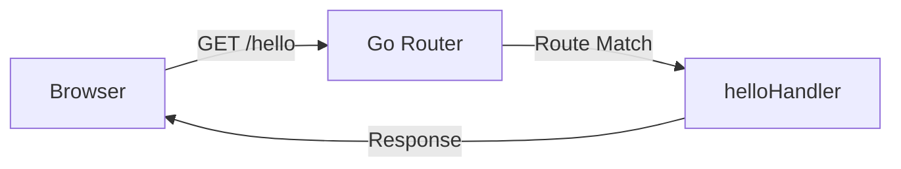

Go has a production-ready web server built right into its standard library. Unlike Node.js (Express) or Python (Flask), you don't need external frameworks to build powerful web applications.

## Understanding net/http

The `net/http` package provides everything you need:
- HTTP routing and handlers
- Static file serving
- Form parsing
- Request/response handling



## Complete Web Server Example

Here's a fully functional web server that handles routing, serves static files, and processes forms:

```go
package main

import(
	"fmt"
	"log"
	"net/http"
)

func formHandler(w http.ResponseWriter, r *http.Request) {
	if r.Method != http.MethodPost {
		http.Error(w, "Method not allowed", http.StatusMethodNotAllowed)
		return
	}
	if r.URL.Path != "/form" {
		http.Error(w, "Not found", http.StatusNotFound)
		return
	}

	if err := r.ParseForm(); err != nil {
		http.Error(w, "Error parsing form", http.StatusBadRequest)
		return
	}

	name := r.FormValue("name")
	address := r.FormValue("address")

	fmt.Fprintf(w, "Name: %s, Address: %s", name, address)
}

func helloHandler(w http.ResponseWriter, r *http.Request) {
	if r.Method != http.MethodGet {
		http.Error(w, "Method not allowed", http.StatusMethodNotAllowed)
		return
	}
	if r.URL.Path != "/hello" {
		http.Error(w, "Not found", http.StatusNotFound)
		return
	}
	fmt.Fprintf(w, "Hello, World!")
}

func main() {
	// Serve static files from the "static" directory
	fileServer := http.FileServer(http.Dir("./static"))
	http.Handle("/", fileServer)
	
	// Register route handlers
	http.HandleFunc("/form", formHandler)
	http.HandleFunc("/hello", helloHandler)

	fmt.Println("Starting server on :8080")
	if err := http.ListenAndServe(":8080", nil); err != nil {
		log.Fatal(err)
	}
}
```

## Building the Server Step by Step

<Steps>

### Create the project structure

Create a new directory with a `static` folder for HTML files:

```bash
mkdir -p GoProjects/static
cd GoProjects
```

### Create the HTML form

Create `static/form.html`:

```html
<!DOCTYPE html>
<html lang="en">
<head>
    <meta charset="UTF-8">
    <meta name="viewport" content="width=device-width, initial-scale=1.0">
    <title>Document</title>
</head>
<body>
    <div>
        <form action="/form" method="post">
            <label for="name">Name:</label>
            <input type="text" id="name" name="name" required>
            <label for="address">Address:</label>
            <input type="text" id="address" name="address" required>

            <input type="submit" value="Submit">
        </form>
    </div>
</body>
</html>
```

### Create the main server file

Create `main.go` with the complete server code shown above.

### Run the server

```bash
go run main.go
```

The server starts on port 8080 and blocks forever (until you press Ctrl+C).

### Test the endpoints

Open your browser and visit:
- `http://localhost:8080/` - Serves static files from the `static/` directory
- `http://localhost:8080/hello` - Returns "Hello, World!"
- `http://localhost:8080/form.html` - Shows the HTML form

</Steps>

## Understanding HTTP Routing

### Handler Functions

Handler functions receive two parameters:
- `w http.ResponseWriter` - Used to write the HTTP response
- `r *http.Request` - Contains request data (method, URL, form values, etc.)

```go
func helloHandler(w http.ResponseWriter, r *http.Request) {
    // Validate HTTP method
    if r.Method != http.MethodGet {
        http.Error(w, "Method not allowed", http.StatusMethodNotAllowed)
        return
    }
    
    // Validate URL path
    if r.URL.Path != "/hello" {
        http.Error(w, "Not found", http.StatusNotFound)
        return
    }
    
    // Write response
    fmt.Fprintf(w, "Hello, World!")
}
```

### Registering Routes

Go provides two ways to register routes:

**http.HandleFunc** - For simple handler functions:
```go
http.HandleFunc("/hello", helloHandler)
```

**http.Handle** - For more complex handlers (like file servers):
```go
fileServer := http.FileServer(http.Dir("./static"))
http.Handle("/", fileServer)
```

## Static File Serving

The `http.FileServer` creates a handler that serves files from a directory:

```go
fileServer := http.FileServer(http.Dir("./static"))
http.Handle("/", fileServer)
```

This automatically:
- Serves `index.html` for directory requests
- Sets correct Content-Type headers
- Handles 404s for missing files
- Supports subdirectories

## Form Handling

The `formHandler` demonstrates complete form processing:

```go
func formHandler(w http.ResponseWriter, r *http.Request) {
    // 1. Validate it's a POST request
    if r.Method != http.MethodPost {
        http.Error(w, "Method not allowed", http.StatusMethodNotAllowed)
        return
    }
    
    // 2. Parse the form data
    if err := r.ParseForm(); err != nil {
        http.Error(w, "Error parsing form", http.StatusBadRequest)
        return
    }
    
    // 3. Extract form values
    name := r.FormValue("name")
    address := r.FormValue("address")
    
    // 4. Send response
    fmt.Fprintf(w, "Name: %s, Address: %s", name, address)
}
```

### Form Parsing Methods

- `r.ParseForm()` - Parses form data and populates `r.Form`
- `r.FormValue("key")` - Gets a single form value (calls ParseForm automatically)
- `r.PostFormValue("key")` - Only gets POST body values (ignores URL parameters)

## Starting the Server

The `http.ListenAndServe` function starts the server and blocks forever:

```go
fmt.Println("Starting server on :8080")
if err := http.ListenAndServe(":8080", nil); err != nil {
    log.Fatal(err)
}
```

**Parameters:**
- `:8080` - The port to listen on (`:` means all network interfaces)
- `nil` - Use the default `ServeMux` (router) created by `http.HandleFunc`/`http.Handle`

<Note>
**Important:** When `main()` finishes, the program dies instantly. `ListenAndServe` blocks forever, keeping your server running until you press Ctrl+C.
</Note>

## Key Concepts

### Stateless Power

Go's web server is stateless by design:
- Each request is independent
- No session data is stored between requests
- Perfect for REST APIs and microservices

### Error Handling

Always validate:
1. **HTTP Method** - Is it GET, POST, etc.?
2. **URL Path** - Is this the correct endpoint?
3. **Form Data** - Can it be parsed without errors?

```go
if r.Method != http.MethodPost {
    http.Error(w, "Method not allowed", http.StatusMethodNotAllowed)
    return
}
```

### Response Writing

Use `fmt.Fprintf` to write formatted responses:

```go
fmt.Fprintf(w, "Name: %s, Address: %s", name, address)
```

Or `http.Error` for error responses:

```go
http.Error(w, "Not found", http.StatusNotFound)
```

## Next Steps

- Add more routes and handlers
- Implement JSON API endpoints
- Add middleware for logging and authentication
- Connect to a database for persistent storage
- Deploy your server to production
